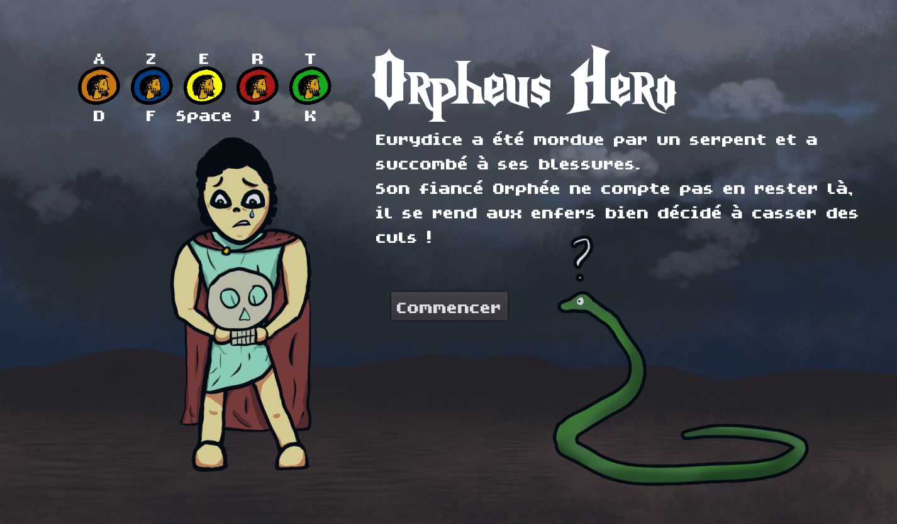
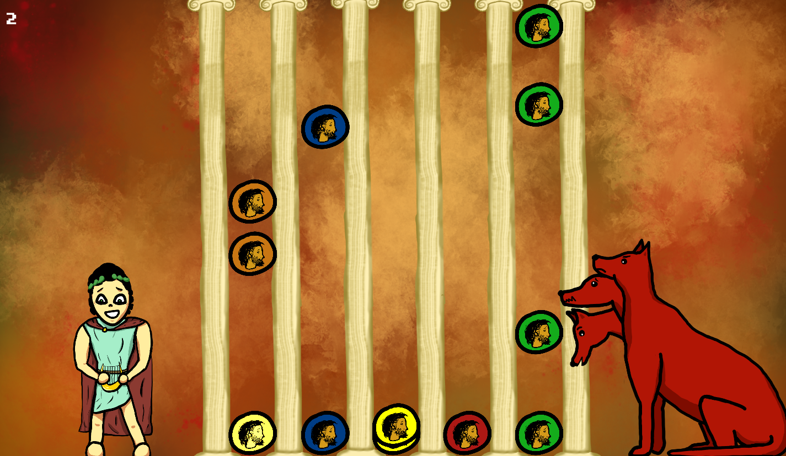
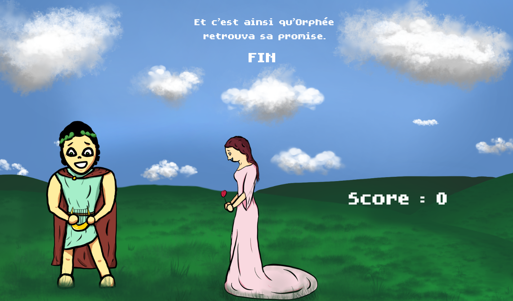

# Abyzzes

GameJam october 2022

> Lilian et Marian

Game jam sur le thème "Abyzzes".

Nous avons fait un jeu de rythme dans lequel Orphée doit jouer de la musique pour sauver Eurydice.
Le jeu a été programmé avec le moteur de jeu Godot version 3.5.

Voici quelques captures d'écran du jeu avec l'écran titre, le jeu et l'écran de fin.

